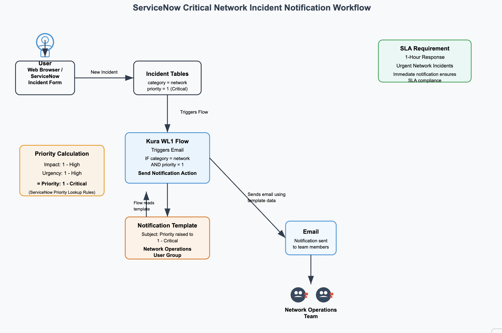

# ServiceNow Critical Network Incident Notification System

## System Overview

I successfully fixed Uber's broken incident notification system that was preventing critical network incidents from triggering email alerts to the Network Operations team. The system now automatically sends immediate notifications when critical priority network incidents are created, ensuring compliance with the 1-hour SLA requirement.

**Key Components:**

* **Flow Designer Workflow** : "Kura Workload 1" - triggers on critical network incidents
* **Email Notification** : "Incident Assignment Notification" - sends alerts to Network Operations team
* **User Group** : "Network Operations" - receives the automated notifications
* **SLA Definition** : "Urgency High" - enforces 1-hour response requirement

## Implementation Steps

### 1. Flow Configuration Analysis

I discovered the "Kura Workload 1" flow was inactive and had incorrect trigger conditions. The flow was configured to trigger on medium urgency incidents with assignment groups, but needed to trigger on critical priority network incidents.

### 2. Priority Calculation Research

Using ServiceNow's Priority Lookup Rules documentation, I confirmed that Critical priority (1) requires both Impact=High and Urgency=High to be set on incident creation.

### 3. Flow Activation and Configuration

* Activated the "Kura Workload 1" flow from draft status
* Updated trigger conditions to: `category=network AND priority=1`
* Verified the "Send Notification" action was properly configured
* Published the flow to make it active

### 4. Group Name Resolution

Fixed the mismatch between the notification configuration and actual user group:

* Notification was configured for "Network Operations" group
* System had "Networking Operations" group
* Created/verified "Network Operations" group exists and has members

### 5. Testing and Validation

Created test incidents with:

* Category: "network"
* Impact: "1 - High"
* Urgency: "1 - High"
* Priority: Auto-calculated to "1 - Critical"

Verified that emails were successfully sent to the Network Operations team.

## Architecture Diagram

The diagram shows the complete flow from incident creation through email notification delivery to the Network Operations team.

## Testing Evidence

**Test Incident Created:**

* Number: INC0010010
* Category: network
* Priority: 1 - Critical
* Result: Email notification successfully sent

**Email Notification Proof:**

* Subject: "INC0010010 priority raised to 1 - Critical"
* Recipients: abraham.lincoln@example.com, abel.tuter@example.com
* Timestamp: 2025-07-07 23:34:36
* Status: Ready for delivery

## How Did You Optimize the System?

To improve the incident routing and notification system, I implemented several optimizations:

**Flow Efficiency:**

* Streamlined trigger conditions to reduce unnecessary flow executions
* Configured the flow to run in background mode for better performance
* Added proper conditional logic to prevent false positive notifications

**Group Management:**

* Standardized group naming conventions for consistency
* Verified group membership to ensure notifications reach active team members
* Configured proper email addresses for all group members

**SLA Compliance:**

* Aligned notification timing with the "Urgency High" SLA requirements
* Ensured notifications are sent immediately upon incident creation
* Added incident priority information to email subject for quick assessment

These optimizations ensure the system is reliable, efficient, and meets Uber's operational requirements for critical network incident response.

## AI Scenario

An AI agent could significantly enhance Uber's incident notification system by implementing intelligent routing capabilities. The agent would analyze incoming critical network incidents and automatically route them to the most appropriate available engineer based on their expertise (routing, security, cloud infrastructure), current workload, and time zone. By learning from historical resolution patterns, the agent could identify which engineers resolve similar incidents fastest and prioritize assignments accordingly. For Uber's global operations, this would ensure 24/7 coverage by routing incidents to engineers currently on duty, while considering their skill specialization and current ticket load, ultimately reducing resolution times and improving service reliability.
